## Introduction
In this series of posts, we will be reverse engineering a couple of binaries from the [reversing.kr](http://reversing.kr/) website. 

We will start with the executable *Easy Crack* and find a valid key for it.

## Basic Analysis
At first sight, we are dealing with a **dynamically linked, 32 bit Windows binary**.
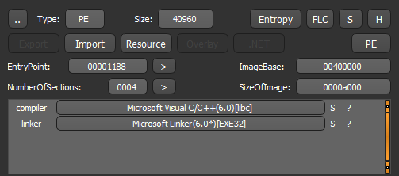
On program execution, we can see a dialog asking for some kind of input, and a button.
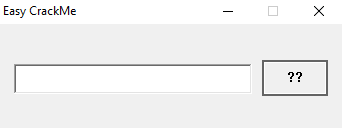
Upon feeding it a random input and pressing the button, we are informed that the input is incorrect.
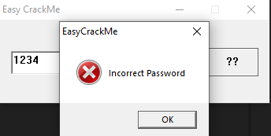
Given how basic this CrackMe seems, we will skip Static Analysis and play a little with the debugger.

## Dynamic Analysis
Once we load the executable in the debugger, we can find some interesting strings in it.
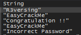
As of now, we are interested in "Incorrect Password" and "Congratulation !!". Both of these strings are used to call the MessageBox API, depending on the input given by the user.
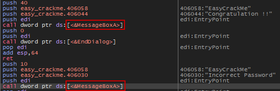
If we scroll up a few instructions, we can analyze where the decision of displaying either of the strings is taken. We can determine that the user input is being taken from the GetDlgItemTextA API just above.
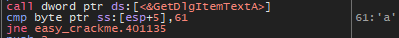
So we can place a breakpoint just there, and follow the execution to carefully discover what the correct input should be. Our dummy input will be "123456789".

Once the function is called, the eax register contains the size of the input we gave to the program, and the actual input is stored on the stack.
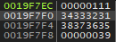
The first interesting check is done right after the call to GetDlgItemTextA, and compares [esp+5] to 0x61 ('a').

Observing the contents of [esp+5], we can see it points to the second element of our input. This means that the second character of our input shall be an 'a'.
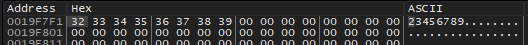
Right after this, the rest of our input ("3456789") is loaded into ecx, and both ecx and the value "5y" are pushed to the stack, before a function is called.
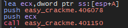
Without inspecting much, this function just seems to compare our input to "5y". We can observe this by inspecting the return value after the function is called. If our input does not contain "5y" after the previous 'a', we get the following.
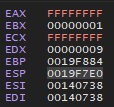
However, if it does, the return value is 0.
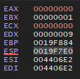
Once this is done, the following instructions load the value "R3versing", and the rest of our string ("56789"), and compare the first byte of both ('R' with '5').
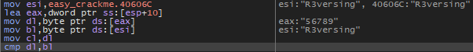
This happens again right below with the next byte (namely '3' and '6').
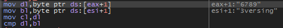
However, once this is done, the following instructions check if the input is done being compared to the "R3versing" string, and if not, make a loop.
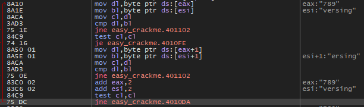
So up to this point, we can infer that the input that should be given to the executable is "?a5yR3versing", where we don't know the value of '?'.

Right at the end of the loop, however, we notice a last minute comparison between the first byte of our input [esp+4], and the value 0x45 ('E').
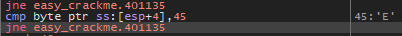
Finally, we know the value of the input should be "**Ea5yR3versing**".
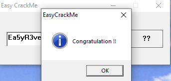
